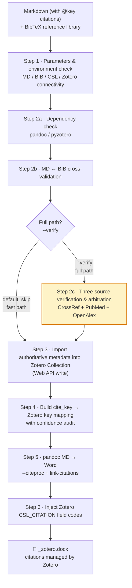

# md2word-skill

**English** | [简体中文](./README.zh-CN.md)

> **Markdown + BibTeX → Zotero-managed Word documents**: converts pandoc-style citations `[@key]` into Zotero `CSL_CITATION` field codes, making citations "live" — managed by Zotero, so citation styles and reference lists can be refreshed at any time.

[](./LICENSE)
[](#)
[](#prerequisites--installation)

A [Claude Code](https://docs.anthropic.com/en/docs/claude-code) Skill designed for the research-writing workflow where you write in Markdown, manage references in Zotero, and need to deliver a Word document.

---

## What problem does it solve

Converting Markdown to Word with `pandoc --citeproc` is a common practice in academic writing, but it has a fundamental flaw:

> **Pandoc's output citations are static text.** Once generated, citation numbers, formatting, and the reference list are "baked into" the docx. To add a reference later, switch journal styles, or fix a misspelled author name in the BIB, you must edit the source and re-run — losing everything your collaborators (advisor / editor) changed in the Word file.

`md2word-skill` does not let pandoc render the final citations. Instead, it **replaces citations with Zotero field codes** (`ZOTERO_ITEM CSL_CITATION`). This way:

- ✅ Every citation in Word **points to the Zotero library** and is fully equivalent to citations inside the Zotero client.
- ✅ Switch citation format (author-date ↔ numeric), add/remove references, refresh the reference list — just click **Refresh** in Zotero's Word plugin, no re-run needed.
- ✅ When submitting to different journals, swap the CSL style and re-render — all in-text citations update automatically.

Furthermore, the reference metadata imported into Zotero **does not blindly trust your BIB**. It is run through **CrossRef + PubMed + OpenAlex three-source arbitration**, using authoritative data sources to correct common BIB errors (author names, year, volume/issue/pages).

---

## Core features

- **🔗 Zotero field-code injection** — converts `[@key]` into `CSL_CITATION`; citations are centrally managed by Zotero and refreshable inside Word.
- **🛡️ Three-source metadata arbitration** — CrossRef / PubMed / OpenAlex cross-check, using authoritative data to fix BIB errors (BIB is not trusted).
- **📊 Confidence audit** — every cite_key → Zotero mapping is tagged with `high/medium/low` confidence and an anchor (DOI / title / bib), making manual review easy.
- **📑 CSL-driven** — ships with the `physics-in-medicine-and-biology` (PMB) style; supports any CSL. Auto-detects `author-date / numeric / note` citation formats and picks the matching injection strategy.
- **⚡ Dual paths** — fast path (trust BIB, ~40s) and full path (three-source verification, ~100–180s) on demand.
- **🤖 Claude Code native** — type `/md2word` and the agent orchestrates the 6-step flow automatically; the three scripts can also be used as standalone CLIs.

---

## Workflow overview



| Path | Steps | Time | Use case |
|------|-------|------|----------|
| **Fast path** (default) | 1 → 2a+2b → 3 → 4 → 5 → 6 | ≈ 40s | Trust BIB quality, internal draft iteration |
| **Full path** (`--verify`) | 1 → 2a+2b+**2c** → 3 → 4 → 5 → 6 | ≈ 100–180s | **Pre-submission final review**, needs BIB-error correction |

> Defaults to the fast path unless explicitly requested; say "verify / check references / verify" to take the full path.

### The six steps

| Step | Description | Details |
|------|-------------|---------|
| 1 | Collect parameters & environment check (MD/BIB/CSL/Zotero connectivity) | [`docs/step1.md`](./docs/step1.md) |
| 2 | Dependency check + MD↔BIB cross-validation [+ three-source verification & arbitration] | [`docs/step2.md`](./docs/step2.md) |
| 3 | Create Collection + import authoritative metadata | [`docs/step3.md`](./docs/step3.md) |
| 4 | Map cite_key → Zotero key (with confidence/audit) | [`docs/step4.md`](./docs/step4.md) |
| 5 | pandoc MD → Word (`--citeproc`) | [`docs/step5.md`](./docs/step5.md) |
| 6 | Inject Zotero field codes | [`docs/step6.md`](./docs/step6.md) |

---

## Prerequisites & installation

### 1. Install the Skill

Clone this repository into Claude Code's skills directory:

```bash
git clone https://github.com/luciliang/md2word-skill.git ~/.claude/skills/md2word-skill
```

Restart Claude Code, then type `/md2word` to trigger.

### 2. System dependencies

| Dependency | Version | Purpose | Install |
|------------|---------|---------|---------|
| **pandoc** | ≥ 2.11 | MD → Word (`--citeproc`) | `brew install pandoc` |
| **Zotero desktop** | any | Reference library, must be running | [zotero.org/download](https://www.zotero.org/download/) |
| **Python** | ≥ 3.8 | Run the three scripts | system default / `brew install python` |

Python packages:

```bash
pip install pyzotero python-docx lxml bibtexparser
```

### 3. Zotero API: Local vs Web (important)

This skill uses both of Zotero's APIs — **different responsibilities, both required**:

| API | Endpoint | Permission | Role in this skill |
|-----|----------|-----------|--------------------|
| **Local API** | `http://localhost:23119` | **read-only** | Step 1b / 2a — check collections, read library (requires Zotero desktop running) |
| **Web API** | `https://api.zotero.org` | **read & write** | **Step 3 import/write** — required |

**Configure Web API credentials:**

1. **API Key** — visit <https://www.zotero.org/settings/keys>, create a new key, check "Allow library access" + "Allow write access" (import requires write access).
2. **User ID** — on the same page (<https://www.zotero.org/settings/keys>) at the bottom you'll see "*Your userID for use in API calls is XXXXXX*". **This is a numeric ID, not your username.**

Add to your shell config (`~/.zshrc` / `~/.bashrc`):

```bash
export ZOTERO_API_KEY="your API key"
export ZOTERO_USER_ID="your numeric User ID"
```

After `source`-ing, Step 1b will auto-detect connectivity for both APIs.

---

## Quick start

Prepare two files — a Markdown with pandoc citations, and a BibTeX:

**`paper.md`** (excerpt):
```markdown
# Introduction

Optimal Transport Conditional Flow Matching (OT-CFM) has been shown
to effectively learn probability paths [@lipman2023flow; @tong2023flow].

# Method
...
```

**`refs.bib`** (excerpt):
```bibtex
@article{lipman2023flow,
  title   = {Flow Matching for Generative Modeling},
  author  = {Lipman, Yaron and ...},
  doi     = {10.48550/arXiv.2210.02747}
}
```

In Claude Code:

```
/md2word paper.md refs.bib
```

The agent will confirm parameters one by one → check environment → cross-validate → import into Zotero → build the mapping → pandoc conversion → inject field codes, and finally produce:

```
paper_zotero.docx   # citations are Zotero field codes, refreshable
```

Open it in Word — all citations are bound to the Zotero library; click **Refresh** in the Zotero plugin to re-render.

---

### Output conventions

- All intermediate files and the final artifact are written to the **same directory as the MD/BIB** (`OUTDIR`) by default.
- Final filename: `<md_filename>_zotero.docx`
- Intermediate artifacts: `verify_result.json`, `mapping.json`, `pandoc_output.docx`

---

## Three-source arbitration mechanism

Why not import the BIB directly? Because misspelled author names, off-by-one years, and missing volume/issue/pages are far too common in BIB files. In Step 2c, this skill queries three free, key-less authoritative sources for each reference and, after cross-arbitration, **overwrites the BIB with authoritative metadata**:

| Source | Strength | Role |
|--------|----------|------|
| **CrossRef** | Publisher-direct DOI / journal / volume-issue-pages / year | First-choice for journal & publication info |
| **PubMed** (NCBI E-utilities) | Biomedical gold standard, most rigorous author full-names (NLM independent curation) | First-choice for author info |
| **OpenAlex** | Broadest coverage, includes author affiliations / ORCID | Coverage supplement |

**Arbitration flow**: normalize to eliminate false conflicts → judge whether it's the same paper → four-tier disposition:

| Tier | Meaning | Handling |
|------|---------|----------|
| ✅ **PASS** | Three sources agree (or agree after normalization) | Import with authoritative metadata |
| ⚠️ **FLAG** | Substantive conflict but reasonable default | Non-blocking by default — import with best value, write conflict into Zotero `Extra` field; blocks under `--strict` |
| ❌ **REJECT** | Doesn't look like the same paper (title/author/year mismatch) | **Not imported** (avoids polluting the library) |
| ⏭ **SKIP** | Not found in any of the three sources | **Not imported**; `--import-skip` can force-import the BIB value tagged as "unverified" |

**Field best-source** (who wins on real conflicts): authors prefer **PubMed**; journal/volume-issue-pages/year prefer **CrossRef**.

> 💡 The sources are not independent: OpenAlex inherits much of its data from CrossRef, so we don't simply count votes; PubMed's single independent vote carries more weight.

---

## CSL styles & configuration

Citation format, reference-list format, and injection strategy are **all driven by CSL** — it is the core of the workflow.

- **Default style**: `styles/physics-in-medicine-and-biology.csl` (PMB, author-date). Pandoc resolves it automatically, no extra config needed.
- **Switch to another style**: just provide a CSL file path or URL. When switching to a numeric journal (e.g. IEEE), Steps 5/6 will auto-detect `citation-format` and switch to the numeric injection strategy. Alternatively, run the whole flow with the default CSL first, then pick another style inside Zotero.
- **Missing CSL**: lists existing styles under `styles/` and prompts the user to download one.

---

## Project structure

```
md2word-skill/
├── SKILL.md                      # Skill entry (loaded by Claude Code): workflow overview + progressive-read convention
├── README.md                     # This document (English)
├── README.zh-CN.md               # Chinese documentation
├── LICENSE                       # MIT
├── docs/
│   ├── step1.md                  # Step 1: parameter confirmation & environment check
│   ├── step2.md                  # Step 2: dependency check + cross-validation + three-source verification
│   ├── step3.md                  # Step 3: create Collection + import authoritative metadata
│   ├── step4.md                  # Step 4: cite_key → Zotero key mapping (with confidence)
│   ├── step5.md                  # Step 5: pandoc MD → Word
│   └── step6.md                  # Step 6: inject Zotero field codes
├── scripts/
│   ├── verify_references.py      # Cross-validation + three-source verification & arbitration
│   ├── import_zotero.py          # Import authoritative metadata into Zotero
│   └── inject_zotero.py          # Inject CSL_CITATION field codes
└── styles/
    ├── physics-in-medicine-and-biology.csl   # default CSL (dependent)
    └── institute-of-physics-harvard.csl      # parent CSL
```

---

## License

[MIT](./LICENSE) © 2026 luciliang
